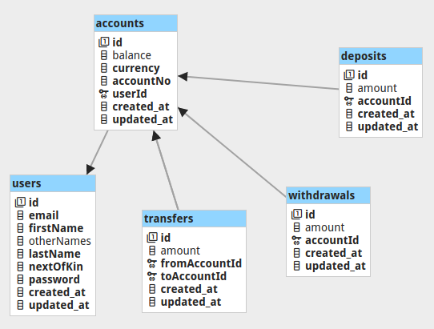

<h1 align="center"> Demo Credit API </h1>

<p align="center">A prototype REST API for demo credit app, built with <a href="https://github.com/nestjs/nest">Nest</a>
</p>

## Description
Demo Credit is a mobile lending app that requires wallet functionality. This is needed as borrowers need a wallet to receive the loans they have been granted and also send the money for repayments.


## Installation

> Ensure [MariaDB](https://mariadb.org) is installed on your system first

```bash
# create .env file, and update database config values
$ cp env.example .env

# install node dependencies
$ npm install
```

## Running the app

```bash
# database migrations
$ npm run knex -- migrate:latest

# development
$ npm run start

# watch mode
$ npm run start:dev

# production mode
$ npm run start:prod
```

> Visit [http://localhost:3000/swagger](http://localhost:3000/swagger) for the Swagger explorer of the api. <br>
> Complete documentation of the API endpoints can be accessed at [http://localhost:3000/docs.html](http://localhost:3000/docs.html)


## Test

```bash
# unit tests
$ npm run test

# e2e tests
$ npm run test:e2e

# test coverage
$ npm run test:cov
```

## Database
Below is the ER Diagram of the database. <br>


There are five tables, *accounts, deposits, users, transfers, withdrawals*
* A user can have multiple accounts
* Deposits table records all deposits into various accounts of the user
* Transfers table records all the transfers made the user
* Withdrawals table records user withdrawals
